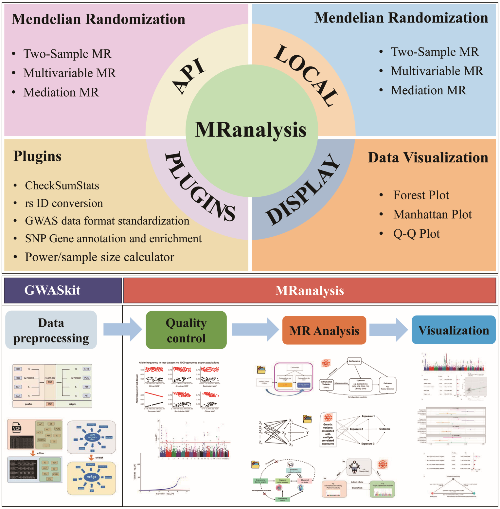
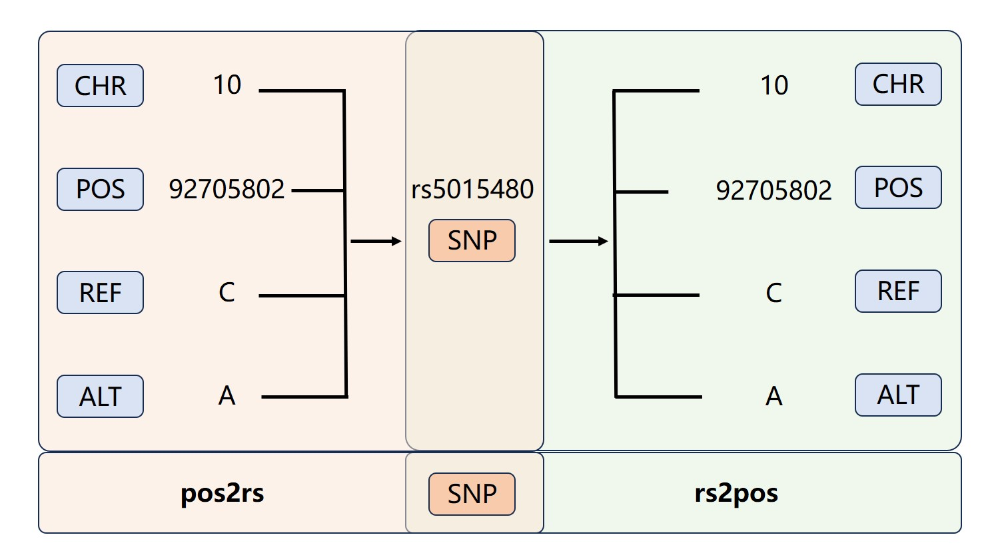
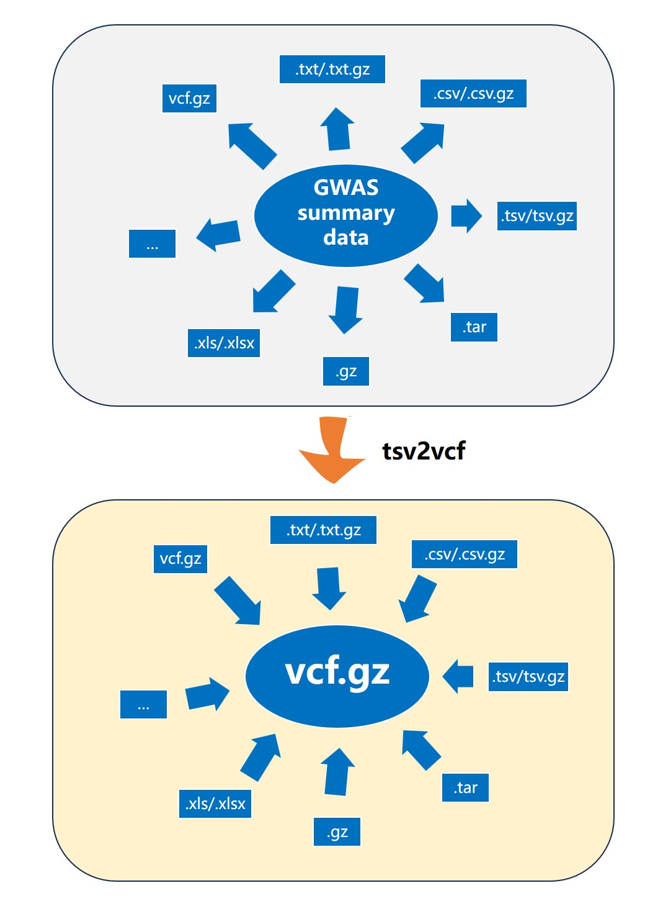
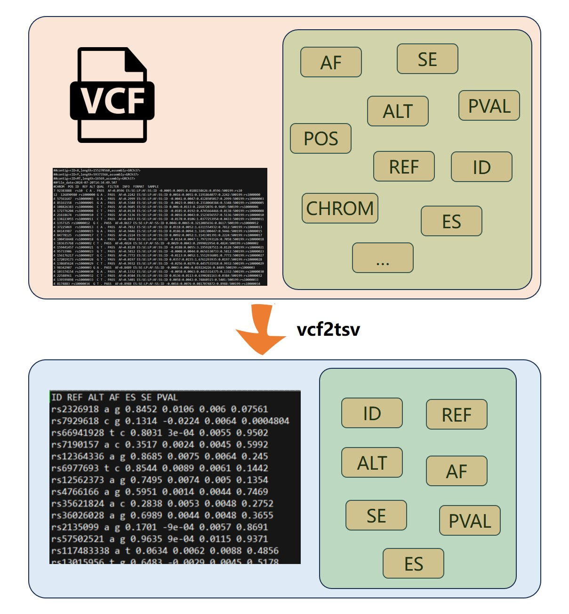

# MRanalysis: A Comprehensive Online Platform for Integrated, Multi-Method Mendelian Randomization and Associated Post-GWAS Analyses

Mendelian randomization (MR) has emerged as a powerful epidemiological method for inferring causal relationships between exposures and outcomes using genome-wide association study (GWAS) summary data. By leveraging instrumental variables (IVs), such as single nucleotide polymorphisms (SNPs), MR can revolutionize our understanding of disease etiology, inform public health strategies, and accelerate drug discovery. However, the widespread adoption of MR is hindered by several challenges, including inconsistent GWAS data formats, lack of standardized workflows, the need for extensive programming expertise, and limitations in data visualization and interpretability. To address these challenges, we introduce MRanalysis, a comprehensive and user-friendly, web-based platform that provides the first integrated and standardized MR analysis workflow. This includes GWAS data quality assessment, power/ sample size estimation, MR analysis, SNP-to-gene enrichment analysis, and data visualization. Built using the R shiny framework, MRanalysis enables users to conduct common MR methods, including univariable, multivariable, and mediation MR analyses through an intuitive, no-code interface. Besides MRanalysis, we developed GWASkit, a standalone, and installation-free tool facilitating rapid GWAS dataset preprocessing before MR analyses, including rs ID conversion, format standardization, and data extraction, with significantly lower conversion time and dramatically higher rs ID conversion accuracy than the current tools. Case studies demonstrate the utility, efficiency, and ease of use of our developed platform and GWASkit tool in real-world scenarios. By lowering barriers to investigating causal genetic relationships, our platform represents a significant advance in making MR more accessible, reliable, and efficient. The increased adoption of MR, facilitated by MRanalysis and GWASkit, can accelerate discoveries in genetic epidemiology, strengthen evidence-based public health strategies, and guide the development of targeted clinical interventions.

MRanalysis is freely available at [http://mranalysis.cn](http://mranalysis.cn/).



# GWASkit

A tool designed to provide fast all-in-one preprocessing for GWAS summary data files.

- [GWASkit](#GWASkit)
- [features](#features)
- [Pre-requirement](#pre-requirement)
- [Quick start](#quick-start)
- [Example workflows](#example-workflows)
  - [pos2rs](#pos2rs-map-chrposrefalt-to-rs-id), Map CHR:POS:REF:ALT to rs ID
  - [rs2pos](#rs2pos-map-rs-id-to-chrposrefalt), Map rs ID to CHR:POS:REF:ALT
  - [tsv2vcf](#tsv2vcf-convert-tsv-to-vcf-format), Convert TSV to VCF format
  - [vcf2tsv](#vcf2tsv-convert-vcf-to-tsv-format), Convert VCF to TSV format

# features
0. Quickly perform rs ID conversion.
1. Supports various GWAS summary data formats.
2. Supports both Windows and CentOS/Ubuntu platforms.
3. Customized extraction of specified information from VCF files.
4. ...

If you find a bug or have additional requirement for `GWASkit`, please file an issue:https://github.com/Li-OmicsLab-MPU/GWASkit/issues/new

# Pre-requirement

Please download several dependent annotation database ([GRCh38](https://figshare.com/ndownloader/files/48635854) or [GRCh37](https://figshare.com/ndownloader/files/48635851)) for rs ID conversion.

# Quick start

This binary was compiled on CentOS/Ubuntu and Windows operating system, and tested on CentOS/Ubuntu and Windows operating system.

Download and install: 

```shell
# download specified version, i.e. GWASkit v1.0.0
$ wget https://github.com/Li-OmicsLab-MPU/GWASkit/releases/download/v1.0.0/GWASkit-1.0.0-amd64_linux.zip
$ unzip GWASkit-1.0.0-amd64_linux.zip
$ cd GWASkit-1.0.0/
$ chmod a+x ./GWASkit
```

Run GWASkit help: 

```shell
$ /tools/GWASkit --help
usage: GWASkit [-h] {pos2rs,rs2pos,tsv2vcf,vcf2tsv} ...

positional arguments:
  {pos2rs,rs2pos,tsv2vcf,vcf2tsv}
    pos2rs              Map CHR:POS:REF:ALT to rs ID
    rs2pos              Map rs ID to CHR:POS:REF:ALT
    tsv2vcf             Convert TSV to VCF format
    vcf2tsv             Convert VCF to TSV format

optional arguments:
  -h, --help            show this help message and exit
```

# Example workflows

## pos2rs, Map CHR:POS:REF:ALT to rs ID

GWASkit's "pos2rs" and "rs2pos" subcommands specifically cater to mapping between rs IDs and their coordinates.

pos2rs: This function maps variant information in the CHR:POS:REF:ALT format to the corresponding rs ID.



```shell
$ /tools/GWASkit pos2rs --help
usage: GWASkit pos2rs [-h] --inputFile INPUTFILE --rsdb RSDB --out OUT [--SEP {1,2,3}] --CHR CHR --POS POS --REF REF --ALT ALT [--gz] [--verbose]

optional arguments:
  -h, --help            show this help message and exit
  --inputFile INPUTFILE, -I INPUTFILE
                        Inupt file (.csv/.csv.gz or .tsv/.tsv.gz), specifying GWAS summary data. Required.
  --rsdb RSDB, -R RSDB  Reference database for rs ID conversion. Required.
  --out OUT, -O OUT     Output file or directory to store the results. Required.
  --SEP {1,2,3}         Delimiter used in the input file. '1' represents space, '2' represents tab, '3' represents comma. Default is tab, namely '2'. Required.
  --CHR CHR             Chromosome for SNPs in the format 1:22, X, Y or MT, required.
  --POS POS             Position for SNPs, required.
  --REF REF             Name of column with effect or reference allele, required.
  --ALT ALT             Name of column with non effect or alternative allele, required.
  --gz, -Z              un/compressed tsv output.
  --verbose, -V         Enable verbose mode for more detailed output.
```

An example in Linux:

```shell
$ /tools/GWASkit pos2rs \
-I /home/hello/wkdir/demo/test_chr22.txt \
-O /home/hello/wkdir/pos2rs_test_chr22.txt.gz \
--rsdb /mnt/HDRIVE/rsdb/GRCh38 \
--CHR chromosome \
--POS base_pair_location \
--REF other_allele \
--ALT effect_allele \
-Z \
--verbose
```

An example in Windows:


## rs2pos, Map rs ID to CHR:POS:REF:ALT

rs2pos: Opposite to the pos2rs function, rs2pos maps rs IDs to the corresponding variant position.

```shell
$ /tools/GWASkit rs2pos --help
usage: GWASkit rs2pos [-h] --inputFile INPUTFILE --rsdb RSDB --out OUT [--SEP {1,2,3}] --rs RS [--keep] [--rm] [--gz] [--verbose]

optional arguments:
  -h, --help            show this help message and exit
  --inputFile INPUTFILE, -I INPUTFILE
                        Inupt file (.csv/.csv.gz or .tsv/.tsv.gz), specifying GWAS summary data. Required.
  --rsdb RSDB, -R RSDB  Reference database for rs ID conversion. Required.
  --out OUT, -O OUT     Output file or directory to store the results. Required.
  --SEP {1,2,3}         Delimiter used in the input file. '1' represents space, '2' represents tab, '3' represents comma. Default is tab, namely '2'. Required.
  --rs RS               Name of column with SNP rs IDs, required.
  --keep, -k            Keep REF and ALF information in output file. Note: if the original file contains related columns, it will be overwritten.
  --rm, -r              If the unmatched rows should be deleted.
  --gz, -Z              un/compressed tsv output.
  --verbose, -V         Enable verbose mode for more detailed output.
```

An example in Linux:

```shell
$ /tools/GWASkit rs2pos \
-I /home/hello/wkdir/demo/test_chr22.txt \
-O /home/hello/wkdir/ \
--rs variant_id \
--rsdb /mnt/HDRIVE/rsdb/GRCh38 \
--SEP 2 \
--rm -Z \
--verbose
```

An example in Windows:


## tsv2vcf, Convert TSV to VCF format

tsv2vcf: This function converts GWAS data in TSV (Tab-Separated Values) format to the standard VCF (Variant Call Format). VCF is a widely used file format for storing genetic variation data, and many downstream analysis tools support direct reading of VCF files. With GWASkit's tsv2vcf function, users can easily standardize GWAS data from different sources into VCF format, enabling seamless integration with the MRanalysis platform.



```shell
$ /tools/GWASkit tsv2vcf --help
usage: GWASkit tsv2vcf [-h] --inputFile INPUTFILE --out OUT [--SEP {1,2,3}] --CHR CHR --POS POS --REF REF --ALT ALT --RSID RSID --BETA BETA --EAF EAF --SE SE --PVALUE PVALUE --SS SS --TYPE
                       {hg19,hg38,GRCh37,GRCh38} [--verbose]

optional arguments:
  -h, --help            show this help message and exit
  --inputFile INPUTFILE, -I INPUTFILE
                        Inupt file (.csv/.csv.gz or .tsv/.tsv.gz), specifying GWAS summary data. Required.
  --out OUT, -O OUT     Output file or directory to store the results. Required.
  --SEP {1,2,3}         Delimiter used in the input file. '1' represents space, '2' represents tab, '3' represents comma. Default is tab, namely '2'. Required.
  --CHR CHR             Chromosome for SNPs in the format 1:22, X, Y or MT, required.
  --POS POS             Position for SNPs, required.
  --REF REF             Name of column with effect or reference allele, required.
  --ALT ALT             Name of column with non effect or alternative allele, required.
  --RSID RSID           Name of column with SNP rs IDs, required.
  --BETA BETA           Alternative allele for SNPs, required.
  --EAF EAF             Name of column with effect allele frequency, required.
  --SE SE               Name of column with standard errors, required.
  --PVALUE PVALUE       Name of column with p-value, required.
  --SS SS               Column name for sample size or specify sample size (number, i.e. 10000) directly, required.
  --TYPE {hg19,hg38,GRCh37,GRCh38}
                        Specifies the genome assembly type. It should be one of the following choices: 'hg19', 'hg38', 'GRCh37', 'GRCh38'. Default is 'hg19'.
  --verbose, -V         Enable verbose mode for more detailed output.
```

An example in Linux:

```shell
$ /tools/GWASkit tsv2vcf \
-I /home/hello/wkdir/demo/test_chr22.txt \
-O /home/hello/wkdir/tsv2vcf_test_chr22.vcf.gz \
--TYPE GRCh38 \
--CHR chromosome \
--POS base_pair_location \
--REF other_allele \
--ALT effect_allele \
--RSID variant_id \
--BETA beta \
--EAF effect_allele_frequency \
--SE standard_error \
--SS 10000 \
--PVALUE p_value \
--verbose
```

An example in Windows:


## vcf2tsv, Convert VCF to TSV format

vcf2tsv: Opposite to the tsv2vcf function, vcf2tsv converts GWAS data in VCF format to TSV format. 



```shell
$ /tools/GWASkit vcf2tsv --help
usage: GWASkit vcf2tsv [-h] --inputFile INPUTFILE --out OUT [--include INCLUDE] [--exclude EXCLUDE] [--gz] [--withCommnet] [--verbose]

optional arguments:
  -h, --help            show this help message and exit
  --inputFile INPUTFILE, -I INPUTFILE
                        Inupt file (.csv/.csv.gz or .tsv/.tsv.gz), specifying GWAS summary data. Required.
  --out OUT, -O OUT     Output file or directory to store the results. Required.
  --include INCLUDE, -IN INCLUDE
                        Include special columns and separate multiple column names with commas. By default, all information is included. Note: if both `Include` and `Exclude` parameters are specified, the
                        `Include` parameter takes precedence over the `Exclude` parameter.
  --exclude EXCLUDE, -EX EXCLUDE
                        Exclude special columns and separate multiple column names with commas. Note: when the `Include` parameter is set, the `Exclude` parameter becomes ineffective.
  --gz, -Z              un/compressed tsv output.
  --withCommnet, -C     Include header in tsv output.
  --verbose, -V         Enable verbose mode for more detailed output.
```

An example in Linux:

```shell
$ /tools/GWASkit vcf2tsv \
-I /home/hello/wkdir/demo/test_chr22.vcf.gz \
-O /home/hello/wkdir \
--exclude 'QUAL,FILTER,INFO' \
--withCommnet \
-Z \
--verbose
```

An example in Windows:


